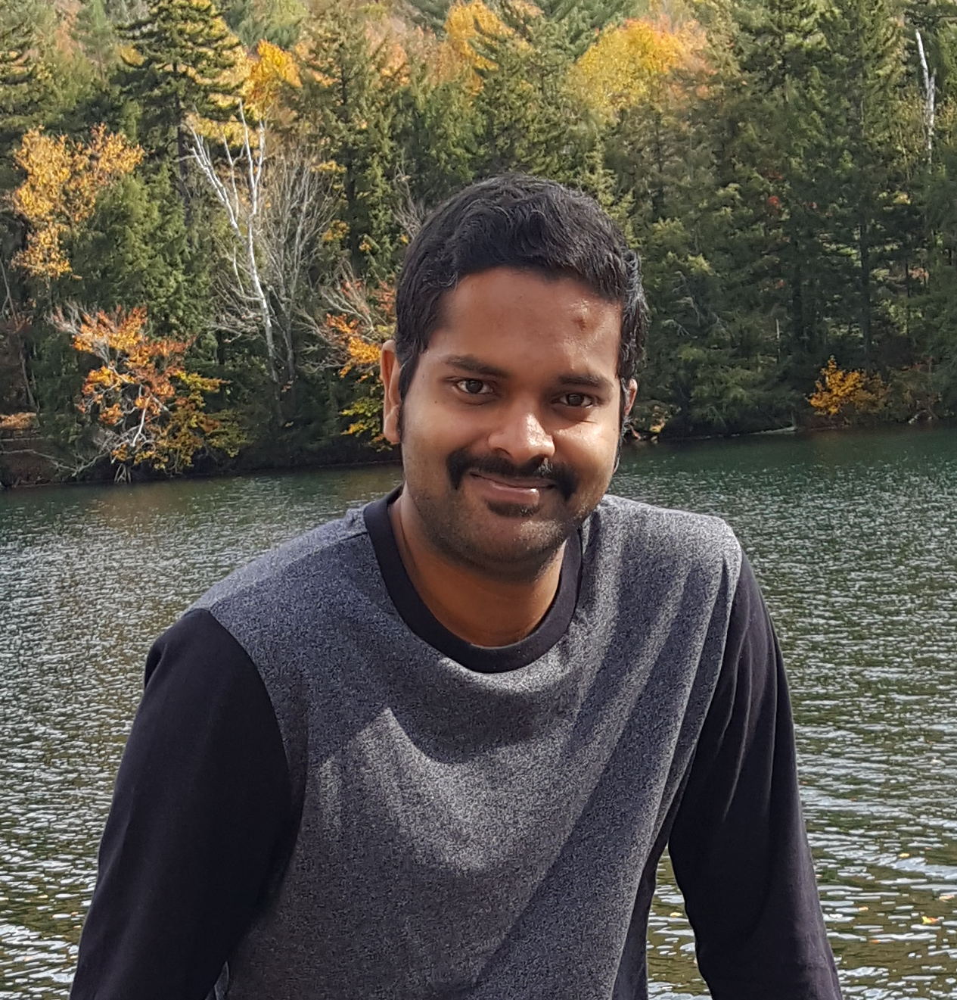

  

  

I am a PhD student in the CS department (since Sep 2016) at the [Intelligent Visual Interfaces](https://ivi.cs.rutgers.edu/) lab in [Rutgers University](https://www.cs.rutgers.edu/) working on Multi-modal A.I., under the supervision of [Dr. Mubbasir Kapadia](https://www.cs.rutgers.edu/people/professors/details/mubbasir-kapadia) and [Dr. Gerard De Melo](http://gerard.demelo.org/). Particularly, I work on joint understanding of images/videos with abstract and narrative text with applications to story illustration, 
visual storytelling, image captioning and image retrieval. I previously worked on authenticating multimedia content 
such as videos and images using passive image analysis techniques and Machine Learning. 

### Research Interests
- Joint Multi-modal data understanding
- Computer Vision
- Natural Language Processing                       
- Machine/Deep Learning                      
- Image/Video Analysis                       
- Multimedia Forensics

### Current Research
- Story Illustration and Visual Storytelling                      
- Image Captioning and Image retrieval

## PUBLICATIONS

### Journals
1. Sharma S,. **Ravi, H.**, Subramanyam, A. V., Emmanuel, S., "Anti-forensics of Median Filtering and Contrast Enhancement", (Accepted) in Journal of Visual Communication and Image Representation, 2019. [PDF]()

2. **Ravi, H.**, Subramanyam, A. V., Emmanuel, S. “ACE - An Effective Anti-forensic Contrast Enhancement Technique”, IEEE Signal Processing Letters (IEEE SPL), Feb 2016, 23 (2), pp 212-216 . [PDF]() [CODE]()

3. **Ravi, H.**, Subramanyam, A. V., Emmanuel, S. “Forensic Analysis of Linear and Non Linear Image Filtering using Quantization Noise, ACM Transactions on Multimedia Computing Communications and Applications (ACM TOMM), vol. 12, no. 3, p. 39, 2016. [PDF]() [CODE]()

### Conferences
1. **Ravi, H.**, Zhou, H., Muniz, C., Azizi, V., Ness, L., De Melo, G., Kapadia, M., . “GitEvolve: Predicting the evolution of GitHub Repositories”, (In submission)

2. **Ravi, H.**, Wang, L., Muniz, C., Sigal, L., Kapadia, M.. “Show Me A Story: Towards Coherent Neural Story Illustration”, In Proc. of the IEEE Conference on Computer Vision and Pattern Recognition (IEEE CVPR), 2018, pages 7613–7621. [PDF]() [CODE]()

3. **Ravi, H.**, Subramanyam, A. V., Emmanuel, S. “Spatial Domain Quantization Noise Based Image Filtering Detection”, in Proc. IEEE International Conference on Image Processing (IEEE ICIP), Sep 2015, pp. 1180 - 1184 (Oral).  [PDF]() [CODE]

4. **Ravi, H.**., Subramanyam, A. V., Gupta, G. and Avinash Kumar, B., “Compression Noise Based Video Forgery Detection”, in Proc. IEEE International Conference on Image Processing (IEEE ICIP), Oct 2014, pp. 5352 - 5356. [PDF]() [CODE]()
                        

## RESEARCH

## WORK EXPERIENCE

## CONTACT
